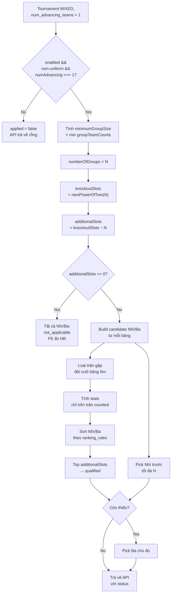
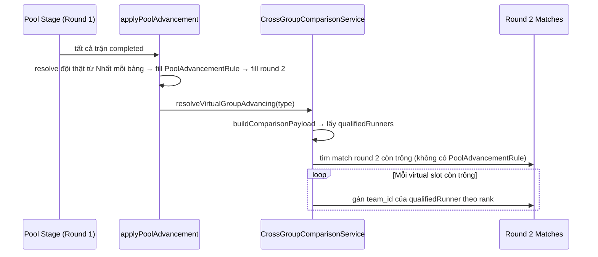

# Logic Xét Đội Nhì/Ba Vào Vòng Sau (Cross-Group Ranking)

Tài liệu này giải thích chi tiết thuật toán **cross-group ranking** — hệ thống quyết định cách lấy thêm đội Nhì/Ba giữa các bảng khi số đội trong các bảng không đồng đều và vòng sau cần đủ số cặp đấu (bội số của 2).

> **Tài liệu liên quan**: [cross-group-ranking-api.md](./cross-group-ranking-api.md) — schema response và chi tiết API endpoint.

---

## Mục lục

1. [Bối cảnh & điều kiện áp dụng](#1-bối-cảnh--điều-kiện-áp-dụng)
2. [Phần 1 — Tính số suất cần lấy thêm](#2-phần-1--tính-số-suất-cần-lấy-thêm-additional-slots)
3. [Phần 2 — Loại trận gặp đội cuối bảng](#3-phần-2--loại-trận-gặp-đội-cuối-bảng-exclude-bottom-team-matches)
4. [Sơ đồ luồng tổng](#4-sơ-đồ-luồng-tổng)
5. [Quy trình 5 bước khi pool stage hoàn tất](#5-quy-trình-5-bước-khi-pool-stage-hoàn-tất)
6. [Hai điểm tích hợp quan trọng](#6-hai-điểm-tích-hợp-quan-trọng)
7. [Ví dụ tổng hợp](#7-ví-dụ-tổng-hợp)
8. [Lưu ý & biên](#8-lưu-ý--biên)

---

## 1. Bối cảnh & điều kiện áp dụng

Hệ thống cross-group ranking chỉ chạy khi **tất cả** các điều kiện sau thoả mãn:

| Điều kiện | Mô tả |
|---|---|
| `format === MIXED` | Thể thức thi đấu hỗn hợp (vòng bảng → vòng trong) |
| `cross_group_ranking.enabled === true` | BTC đã bật tính năng so sánh chéo (qua `advanced_to_next_round` hoặc `cross_group_ranking.enabled`) |
| `number_of_groups >= 2` | Phải có ít nhất 2 bảng để so sánh |
| `is_group_counts_uniform === false` | Số đội giữa các bảng **không** đồng đều (đây là lý do cần xét Nhì tốt nhất) |
| `num_advancing_teams === 1` | Mỗi bảng chỉ lấy đúng 1 đội (Nhất) đi tiếp |

### Tại sao `num_advancing_teams === 1` là điều kiện bắt buộc?

Khi `num_advancing_teams >= 2`, mỗi bảng đã đóng góp **ít nhất Nhất + Nhì** vào vòng sau (số đội từ pool = `numAdvancing × numberOfGroups`). Vì vậy **không cần** so sánh Nhì/Ba giữa các bảng — mỗi bảng đã tự cung cấp Nhì của mình.

Quy tắc so sánh chéo chỉ phát huy tác dụng khi `num_advancing_teams = 1`:
- Mỗi bảng chỉ gửi Nhất đi tiếp → tổng `Nhất = numberOfGroups`.
- Nếu `numberOfGroups < knockoutSlots` (bội số của 2 gần nhất), ta cần **mượn thêm** đội từ các bảng khác.
- Đó chính là lúc Nhì (và Ba nếu cần) được so sánh công bằng để chọn ra những đội "tốt nhất".

Điều kiện này được đánh giá trong `CrossGroupRankingService::evaluate()` — xem [app/Services/TournamentType/CrossGroupRankingService.php](../../picki/app/Services/TournamentType/CrossGroupRankingService.php) (khoảng dòng 60-78).

---

## 2. Phần 1 — Tính số suất cần lấy thêm (additional slots)

### Công thức tổng quát

```
numAdvancing      = num_advancing_teams của pool stage (đã enforce = 1 trong điều kiện áp dụng)
numberOfGroups    = số bảng trong giải
totalFromPool     = numAdvancing × numberOfGroups        // = numberOfGroups khi numAdvancing = 1

knockoutSlots     = nextPowerOfTwo(totalFromPool)        // ceiling power-of-2 >= totalFromPool
additionalSlots   = max(0, knockoutSlots − max(totalFromPool, numberOfGroups))
```

**Ghi chú về `nextPowerOfTwo`**: luôn dùng **ceiling** (lũy thừa 2 nhỏ nhất ≥ tổng), không phải floor. Lý do: vòng knockout cần số slot là bội số của 2 để tạo bracket cân.

Ví dụ:
- 3 bảng → `nextPow2(3) = 4` (không phải 2)
- 5 bảng → `nextPow2(5) = 8` (không phải 4)
- 8 bảng → `nextPow2(8) = 8` (đã là power-of-2)

### Ví dụ số liệu (chỉ áp dụng khi `num_advancing_teams = 1`)

| Kích thước bảng | numAdvancing | totalFromPool | knockoutSlots | additionalSlots | Nguồn lấp thêm |
|---|---|---|---|---|---|
| 3 bảng × 5 đội | 1 | 3 | 4 | **1** | 1 Nhì tốt nhất |
| 4 bảng × [5,5,5,4] | 1 | 4 | 4 | **0** | (đã đủ, không cần) |
| 5 bảng × [4,4,4,4,3] | 1 | 5 | 8 | **3** | 3 Nhì tốt nhất |
| 6 bảng × [5,5,5,5,4,4] | 1 | 6 | 8 | **2** | 2 Nhì tốt nhất |
| 10 bảng × 5 đội | 1 | 10 | 16 | **6** | 6 Nhì + Ba (nếu > số bảng) |
| 12 bảng × 5 đội | 1 | 12 | 16 | **4** | 4 Nhì tốt nhất |

### Quy tắc ưu tiên pick candidate

Khi `additionalSlots > numberOfGroups` (cần lấy nhiều hơn N bảng có thể cung cấp Nhì), hệ thống sẽ pick theo thứ tự:

1. **Ưu tiên Nhì trước** — tối đa `numberOfGroups` Nhì (mỗi bảng 1 Nhì).
2. **Nếu vẫn thiếu** → pick tiếp Ba cho đủ. Số Ba = `additionalSlots − numberOfGroups`.
3. **Nếu `additionalSlots ≤ 0`** → tất cả candidate Nhì/Ba đều được gắn `status = 'not_applicable'` (FE ẩn, kể cả khi `apply_to` có chứa `runner_up`/`third_place`).

Logic này nằm trong `assignQualifiedStatus()` — xem [app/Services/TournamentType/CrossGroupComparisonService.php](../../picki/app/Services/TournamentType/CrossGroupComparisonService.php) (khoảng dòng 770-849).

---

## 3. Phần 2 — Loại trận gặp đội cuối bảng (exclude bottom team matches)

### Vấn đề

Khi các bảng không đồng đều, đội Nhì ở bảng lớn đánh nhiều trận hơn đội Nhì ở bảng nhỏ. Ví dụ:

| Bảng | Số đội | Nhì đánh bao nhiêu trận? |
|---|---|---|
| Bảng 5 đội | 5 | 4 trận (gặp 4 đội còn lại) |
| Bảng 3 đội | 3 | 2 trận (gặp 2 đội còn lại) |

So sánh trực tiếp 2 đội Nhì này là **không công bằng** vì Nhì bảng 5 có nhiều cơ hội tích điểm hơn (đặc biệt khi có đội Ba yếu → dễ lấy điểm "rẻ").

### Giải pháp

Để đảm bảo so sánh công bằng, hệ thống **loại bỏ các trận của Nhì/Ba gặp đội cuối bảng (Ba trở xuống)** trong thống kê dùng để xếp hạng.

**Thuật toán** (`getExcludedOpponentIds` trong `CrossGroupComparisonService`):

```
minimumGroupSize = min(groupTeamCounts)            // = số đội của bảng NHỎ nhất

for each group with size k:
    if k > minimumGroupSize:
        // Loại (k − minimumGroupSize) đội xếp CUỐI bảng khỏi thống kê Nhì/Ba
        excluded = bottom (k − minimumGroupSize) teams theo BXH (kèm H2H)
    else:
        excluded = []                                // bảng nhỏ: không loại gì
```

Sau khi loại, **mỗi đội Nhì chỉ được tính trên các trận gặp đội ở nhóm "top" của bảng mình** — tức là số trận "có ý nghĩa" là bằng nhau giữa các bảng.

### Ví dụ cụ thể

Giải 5 bảng [4,4,4,4,3], `num_advancing = 1`:

- `minimumGroupSize = min(4,4,4,4,3) = 3`.
- 4 bảng 4 đội: `k − m = 4 − 3 = 1` đội cuối bị loại (Ba). Trận Nhì gặp Ba → loại.
- 1 bảng 3 đội: `k − m = 3 − 3 = 0` → không loại gì, tính đầy đủ.

Kết quả: **4 đội Nhì bảng 4** đều được so sánh trên cùng `counted = 3 trận` (chỉ tính trận gặp Nhất + các đội giữa), còn **Nhì bảng 3** vẫn tính 2 trận (đầy đủ vì bảng nhỏ).

**Lưu ý quan trọng**: hệ thống vẫn giữ trận thật của Nhì trong DB (không xoá), chỉ là **không tính** khi so sánh xếp hạng. Các API trả về trường `excluded_matches` để FE biết trận nào bị loại và lý do (`exclusion_reason`).

---

## 4. Sơ đồ luồng tổng



---

## 5. Quy trình 5 bước khi pool stage hoàn tất

Khi 100% trận vòng bảng đã hoàn thành, hệ thống thực hiện 5 bước sau:

### Bước 1 — Xác định Nhất mỗi bảng

Gọi `GroupStandingRanker::rank($group, $rankingRules)` cho mỗi bảng. Hàm này:
- Tính BXH nội bộ theo `ranking_rules` (mặc định `[1, 4, 5, 2, 3]` = points → point_diff → head_to_head → win_rate → sets_diff).
- Áp dụng **HEAD_TO_HEAD** để phá vòng lặp cycle (3 đội đồng hạng, mỗi đội thắng 1).
- Fallback `POINTS_WON + HEAD_TO_HEAD` nếu `ranking_rules` thiếu.

Đội xếp rank 1 trong BXH = **Nhất** (đi tiếp qua pool advancement rule thông thường).

Xem [app/Services/TournamentType/GroupStandingRanker.php](../../picki/app/Services/TournamentType/GroupStandingRanker.php).

### Bước 2 — Tính số suất cần lấy thêm

`additionalSlots = knockoutSlots − numberOfGroups` (xem [Phần 2](#2-phần-1--tính-số-suất-cần-lấy-thêm-additional-slots)).

Nếu `additionalSlots <= 0` → **dừng**, không cần pick thêm Nhì/Ba.

### Bước 3 — Build danh sách candidate Nhì/Ba

`CrossGroupComparisonService::buildCandidates()`:
- Với mỗi bảng, lấy top 2 (Nhì) + top 3 (Ba) theo BXH nội bộ.
- Gắn `candidate_type = 'runner_up'` hoặc `'third_place'`.
- Trả về collection candidate (≤ `2 × numberOfGroups` phần tử).

### Bước 4 — Loại trận đội cuối bảng + tính stats counted

`buildComparisonStats()` cho mỗi candidate:

```
excludedOpponents = getExcludedOpponentIds(group, k, minimumGroupSize)
                   // = bottom (k − m) đội theo BXH có H2H

counted_matches  = matches của candidate KHÔNG thuộc excludedOpponents
excluded_matches = matches của candidate THUỘC excludedOpponents

wins/losses/draws/points_for/points_against/sets_won/sets_lost
                  = tính CHỈ trên counted_matches
```

Trả về các trường: `original`, `counted`, `excluded`, `wins`, `losses`, `draws`, `points`, `sets_won`, `sets_lost`, `win_rate`, `points_for`, `points_against`, `point_diff`, `average_point_difference`.

### Bước 5 — Rank và chọn top N

`rankCandidates()` sort candidates theo thứ tự:
1. `candidate_type` (runner_up trước third_place)
2. `ranking_rules` (points → win_rate → sets_diff → point_diff → head_to_head)

Sau đó `assignQualifiedStatus()` đánh dấu:
- Top `additionalSlots` (và ưu tiên Nhì trước) → `qualified`
- Còn lại → `not_qualified`
- Nếu `additionalSlots <= 0` → tất cả `not_applicable`

Trả về candidates qua API 1 (`GET /api/tournament-types/{id}/cross-group-comparison`).

---

## 6. Hai điểm tích hợp quan trọng

Thuật toán trên được dùng ở **hai chỗ** trong vòng đời giải đấu:

### 6.1. PHASE 2.5 — Chèn virtual "Nhì tốt nhất" placeholder khi generate round 2

Khi tạo giải (hoặc khi regenerate) trong `TournamentTypeController::generateMixed()` và `generateMixedWithAssignedTeams()`:

```
// PHASE 2.5: tự động thêm bảng ảo cho Nhì tốt nhất
if ($crossGroupEval['applied']) {
    totalFromRealGroups = numAdvancing × numberOfGroups
    nextPowerOfTwo      = ceil power-of-2 of totalFromRealGroups
    virtualSlotsNeeded  = nextPowerOfTwo − totalFromRealGroups

    if (virtualSlotsNeeded > 0) {
        for (v = 0; v < virtualSlotsNeeded; v++) {
            advancingByRank[1]->push((object)[
                'team_id'        => null,
                '_from_group'    => null,
                '_virtual'       => true,
                '_virtual_index' => v + 1,
                '_rank'          => 2,
            ]);
        }
    }
}
```

Các placeholder này:
- Được tạo **trước** khi pool stage kết thúc (vì cần cấu trúc bracket round 2 ngay khi generate).
- Có flag `_virtual = true` để `TeamPairingService::arrangeAdvancingTeams` route sang `arrangeSequentialWithVirtual` / `arrangeSymmetricWithVirtual`.
- **Không tạo** `PoolAdvancementRule` cho virtual slots → để sau này fill bằng Nhì tốt nhất thật.
- Được resolve về đội thật bởi `CrossGroupComparisonService::resolveVirtualGroupAdvancing()` (chạy trong `applyPoolAdvancement()`).

Xem [app/Http/Controllers/TournamentTypeController.php](../../picki/app/Http/Controllers/TournamentTypeController.php) — khoảng dòng 1159-1187 (`generateMixed`) và dòng 3579-3604 (`generateMixedWithAssignedTeams`).

### 6.2. resolveVirtualGroupAdvancing — Fill match round 2 trống

Sau khi pool stage hoàn tất và `applyPoolAdvancement()` chạy:



Xem [app/Services/TournamentType/CrossGroupComparisonService.php](../../picki/app/Services/TournamentType/CrossGroupComparisonService.php) — `resolveVirtualGroupAdvancing` (khoảng dòng 974-1043).

---

## 7. Ví dụ tổng hợp

### Scenario

- **Giải**: 19 đội, format MIXED, 5 bảng [4, 4, 4, 4, 3].
- **Cấu hình**: `num_advancing_teams = 1`, `cross_group_ranking.enabled = true`.
- **Bật**: `advanced_to_next_round = true` (đồng bộ sang `cross_group_ranking.enabled`).

### Áp dụng thuật toán

#### Bước 1: Tính suất cần lấy thêm

```
numberOfGroups    = 5
totalFromPool     = 1 × 5 = 5
knockoutSlots     = nextPowerOfTwo(5) = 8
additionalSlots   = 8 − 5 = 3
```

→ Cần **3 Nhì tốt nhất**.

#### Bước 2: Build candidates

Mỗi bảng → 1 Nhì + 1 Ba (nếu có ≥ 3 đội) = **5 Nhì + 4 Ba** (bảng 3 đội không có Ba) = 9 candidates.

#### Bước 3: Loại trận đội cuối bảng + tính stats

`minimumGroupSize = 3`.

| Bảng | k | k − m | Loại bao nhiêu? | Ai bị loại? |
|---|---|---|---|---|
| A (4 đội) | 4 | 1 | Ba A | Trận Nhì A gặp Ba A |
| B (4 đội) | 4 | 1 | Ba B | Trận Nhì B gặp Ba B |
| C (4 đội) | 4 | 1 | Ba C | Trận Nhì C gặp Ba C |
| D (4 đội) | 4 | 1 | Ba D | Trận Nhì D gặp Ba D |
| E (3 đội) | 3 | 0 | (không loại) | Tính đầy đủ |

Sau khi loại, mỗi Nhì được so sánh trên:
- Bảng 4 đội: `counted = 3` trận (gặp 3 đội top, không tính Ba).
- Bảng 3 đội: `counted = 2` trận (tính đầy đủ).

#### Bước 4: Rank Nhì theo ranking_rules

Sort theo: `points → win_rate → sets_diff → point_diff → head_to_head`.

#### Bước 5: Pick top 3

3 Nhì có rank cao nhất → `qualified`. 2 Nhì còn lại → `not_qualified`. 4 Ba → `not_applicable` (vì `additionalSlots = 3 ≤ numberOfGroups = 5`).

#### Kết quả round 2

```
Round 2: 5 Nhất + 3 Nhì tốt nhất = 8 đội → 4 trận (8/2 = 4)
```

---

## 8. Lưu ý & biên

### Các trường hợp `applied = false`

| Trường hợp | Lý do | API trả về |
|---|---|---|
| `format !== MIXED` | Không phải thể thức hỗn hợp | `enabled` đúng giá trị config, `applied = false`, `candidates = []` |
| `cross_group_ranking.enabled = false` | BTC chưa bật | Tương tự |
| `number_of_groups < 2` | Chỉ có 1 bảng | Tương tự |
| `is_group_counts_uniform = true` | Các bảng đồng đều → mỗi bảng Nhì đánh cùng số trận → không cần xét | Tương tự |
| **`num_advancing_teams >= 2`** | **Mỗi bảng đã có Nhất + Nhì → không cần so sánh chéo** | **Tương tự** (đã fix) |

### Các trường hợp `additionalSlots <= 0` (đã đủ đội)

Khi `totalFromPool` đã là power-of-2 hoặc lớn hơn `knockoutSlots`:
- `additionalSlots = 0` → tất cả Nhì/Ba = `not_applicable` (FE ẩn).
- Vẫn có thể show rule text trong description (qua `evaluateConfiguration` → `configured = true`).

### Ưu tiên trong ranking_rules

Nếu user không config `ranking_rules`, hệ thống fallback về `[1, 4, 5, 2, 3]` (points → point_diff → head_to_head → win_rate → sets_diff) — giống `TournamentTypeController::getRank()`. Có thể bị cycle (3 đội đồng hạng) → `HEAD_TO_HEAD` sẽ phá vòng lặp theo team_id nhỏ nhất.

### Đồng bộ với KnockoutRebuildService

`KnockoutRebuildService` (sau khi pool stage xong, cho phép sửa lại pairing) **tái sử dụng** `CrossGroupComparisonService::buildRankedCandidates()` để đảm bảo kết quả luôn giống API comparison. Khi user thay đổi kết quả trận vòng bảng rồi rebuild round 2, thuật toán sẽ chạy lại từ đầu với stats mới.

Xem [app/Services/TournamentType/KnockoutRebuildService.php](../../picki/app/Services/TournamentType/KnockoutRebuildService.php) — `buildCandidatesList()` (khoảng dòng 35-150) và `resolveVirtualCandidates()` (khoảng dòng 369-470).

---

## Tham chiếu mã nguồn

| File | Vai trò |
|---|---|
| [app/Services/TournamentType/CrossGroupRankingService.php](../../picki/app/Services/TournamentType/CrossGroupRankingService.php) | Config normalization + applicability check (`evaluate`, `evaluateConfiguration`) |
| [app/Services/TournamentType/CrossGroupComparisonService.php](../../picki/app/Services/TournamentType/CrossGroupComparisonService.php) | Build/rank candidates, loại trận, resolve virtual slots |
| [app/Services/TournamentType/GroupStandingRanker.php](../../picki/app/Services/TournamentType/GroupStandingRanker.php) | BXH có H2H + ranking rules |
| [app/Services/TournamentType/KnockoutRebuildService.php](../../picki/app/Services/TournamentType/KnockoutRebuildService.php) | Rebuild pairing sau khi pool stage xong |
| [app/Http/Controllers/TournamentTypeController.php](../../picki/app/Http/Controllers/TournamentTypeController.php) | PHASE 2.5 trong `generateMixed` / `generateMixedWithAssignedTeams` |
| [docs/cross-group-ranking-api.md](../../picki/docs/cross-group-ranking-api.md) | API doc (schema response, chi tiết endpoint) |
